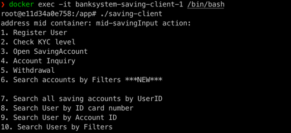
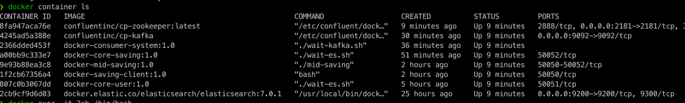
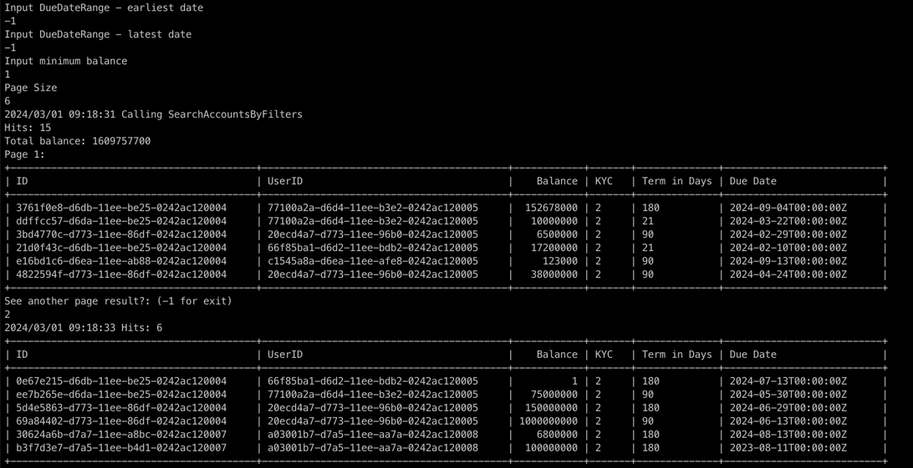
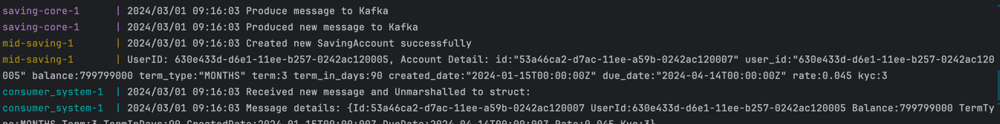

# BÀI TẬP MODULE BACKEND
Người thực hiện: Nguyễn Đại Nghĩa (nghiand)

## Yêu cầu:
- Triển khai các services lên container của docker
- Viết các API gRPC mô phorng các chức năng:
  - Đăng ký user mới
  - Kiểm tra thông tin KYC
  - Tạo tài khoản tiết kiệm: với các thông tin số dư, kỳ hạn, lãi suất, lãi ước tính,...
  - Truy vấn thông tin tài khoản tiết kieemj
  - Rút tiền từ tài khoản tiêết kiệm: rút đúng ngày đáo hạn, ruút sớm
  - Truy vấn danh sách tài khoản tiết kiệm của một khách hàng
  - Truy vấn danh sách tài khoản tiết kiệm dựa trên các fields:
    - KYC
    - Số dư tối thiểu
    - Ngày đáo hạn (khoảng thời gian)
    - Kỳ hạn
  - Phân trang danh sách kết quả trả về, cung cấp các thông tin về số lượng và tổng số dư của các tài khoản thỏa điều kiện
- Produce message mỗi khi có tài khoản mới được tạo, để một hệ thống bên ngoài có thể nhận
## Thực hiện

### Các công nghệ / thư viện đã tìm hiểu và sử dụng
#### gRPC
- Định nghĩa message và service để giao tiếp giữa các service
- Các API gRPC cơ bản:
    - Đăng ký mới user
    - Kiểm tra KYC level
    - Mở tài khoản tiết kiệm
    - Truy vấn thông tin tài khoản
    - Lấy danh sách tài khoản đáp ứng các yêu cầu
    - Rút tiền, cập nhật số dư tài khoản
    - Truy vấn thông tin user
    - Tìm kiếm user hoặc danh sách user theo yêu cầu
   (demo console client)
#### Go tag injection
- Đánh thêm các custom tag cho các fields của message trong proto.

- Sau khi generate các file .pb.go, sử dụng go tag injection để lấy được các fields cần thiết, từ đó lấy được các thông tin phục vụ cho việc indexing document trong elasticseach
#### Reflection
- Tìm hiểu các kỹ thuật reflection cơ bản trong go
- Sử dụng trong đọc các object: ví dụ đọc các tag quy ước trong proto để lấy ra các fields phù hợp để index vào elasticsearch
#### Docker
- Tìm hiểu các khái niệm cơ bản: image, container, dockerhub, pulling, tạo custom image. Khởi chạy, dừng, xóa các container và image.
- Chèn lệnh bash vào container bằng docker exec
- Viết dockerfile cho từng service, đóng gói các services thành các images và triển khai thành các container
- Tạo network riêng và config để các container giao tiếp với nhau : sử dụng biến môi trường và tên service trong các địa chỉ
- Viết docker compose: liệt kê các services và cấu hình để các  container khởi chạy đúng kịch bản và giao tiếp được với nhau
- Một số services khi chạy cần phụ thuộc vào service khác đã sẵn sàng, ví dụ các core services cần lấy được các elasticsearch.Client. Do đó sử dụng ENTRYPOINT để  chạy file bash để tạo lệnh chờ thích hợp

#### Search Engine: Elastic Search
- Sử dụng image có sẵn trên dockerhub  để chạy container
- Mapping đường dẫn dữ liệu với thư mục cố định trên máy đang chạy
- 2 index sử dụng trong bài tập: saving, user
- Tạo indexRequest và Do để thực hiện ghi mới một  document vào index
- Tạo updateRequest và Do để thực hiện cập nhật giá trị của một document cho trước
- Tạo các query đơn giản: match, term cho các field quan tâm
- Viết thư viện để sinh query cho các truy vấn liên quan tới nhiều fields: mỗi điều kiện là một map[string]interface{}, tùy thuộc vào phép so sánh và kiểu dữ liệu của field cần lọc sẽ  viết hàm sinh query tương ứng, sau đó đưa tất cả query con vào 1 mảng để tạo  ra câu query cuối cùng. Khi yêu cầu truy vấn về sau mở rộng có thể tái sử dụng mà không cần viết thêm query riêng biệt (đang tiếp tục mở rộng)
- Tìm kiếm và lọc kết quả dựa trên ràng buộc của các fields: kyc, term, min_balance, duedate_early, duedate_late (còn tiếp tục mở rộng). Giá trị nhập vào theo yêu cầu lọc, hoặc -1 để bỏ qua điều kiện lọc của field này.
  Ví dụ: kyc = -1, term = -1, min_balance = 5000000, duedate_early = 01022024, duedate_late = 30042024 để tìm kiếm tất cả tài khoản tiết kiệm tối thiểu 5 triệu, có ngày đáo hạn từ 01/02/2024 đến 30/04/2024
- Thực hiện phân trang cho kết quả tìm kiếm: sử dụng from, size. Tương ứng trong message là page_index và page_size. Ở lần truy vấn đầu tiên sẽ lấy về tổng số kết quả "hits", giá  trị này trả về response và phát sinh số trang kết quả phù hợp. Ở client có thể tiếp tục nhập index của trang khác để tiếp tục xem các kết quả khác

#### Message broker: Kafka
- Chạy các container từ các images có sẵn: kafka và zookeeper
- Cài đặt trong docker-compose để chạy zookeeper và kafka, expose các cổng cần thiết để các dịch vụ khác nhau có thể truy cập, produce và consume các message
- Tạo delay time bằng file .sh ở ENTRYPOINT của kafka để đảm bảo zookeeper đã khởi chạy và ready
- Trong core-saving service, mỗi khi ghi mới thành công một SavingAccount, sẽ gọi thư viện và method cần thiết để produce một messange. Topic được quy ước là "NewSavingAccountCreated". core-saving chỉ có nhiệm vụ produce message và không quan tâm service nào khác sẽ consume message này
- Viết một service đơn giản tên là consumer-system. Service này có địa chỉ của kafka, được config trong docker-compose, và lắng nghe topic "NewSavingAccountCreated". Trong service này đã được định nghĩa struct SavingAccount phù hợp để có thể unmarshal từ data là []byte thành object của struct SavingAccount
- 
#### Database: (đang thực hiện)
- Sử dụng TiKV để lưu các struct user, saving_account.
- Các yêu cầu truy vấn sẽ được sử dụng elasticsearch tìm kiếm, sau khi có id sẽ gọi tiếp TiKV database để lấy dữ liệu

